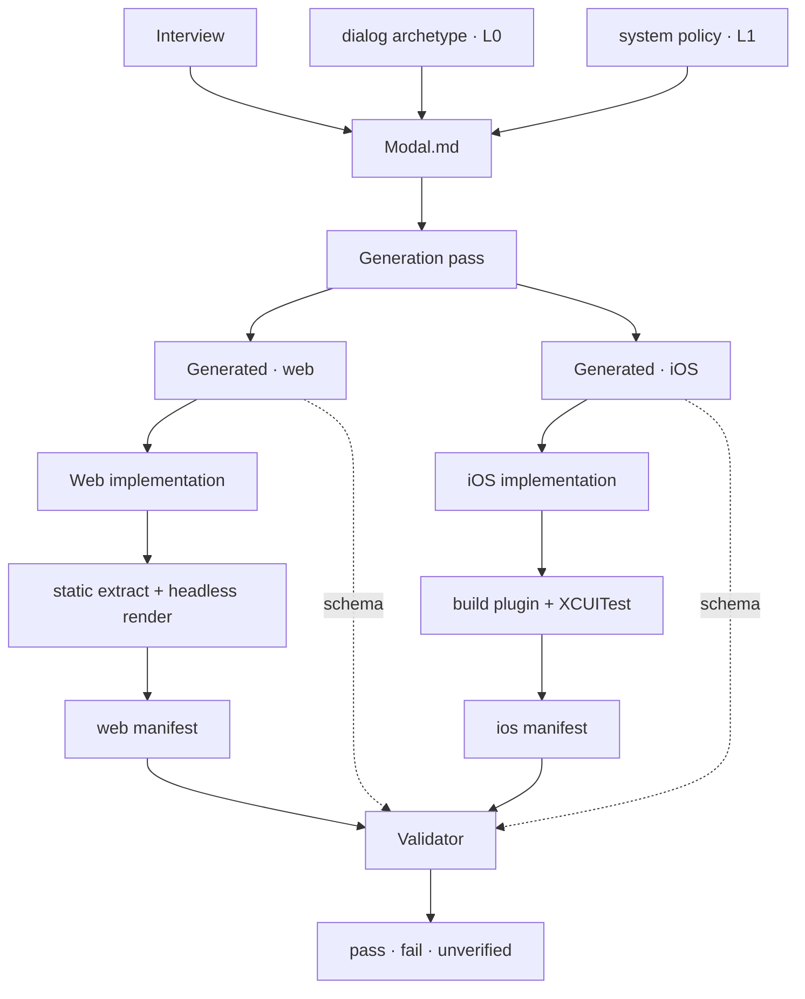

# Contract format v3 — contract, manifest, schema

**Status: proposal.** Raised 2026-09-09. Supersedes the v2 draft's structure; keeps its
requirement/observation split and its three-state result.

## The question this answers

> One human-readable design-intent document, abstract enough to hold for every platform,
> specific enough to generate a per-platform JSON Schema that validates an implementation
> at build time.

v2 got the first half right and stalled on the second, because it never said *what the
schema validates*. A JSON Schema validates JSON. An implementation is Swift, Kotlin, or
TypeScript. Nothing in v1 or v2 bridges that, and on Web the gap is easy to miss because
the DOM is already a queryable tree — which is exactly why the format ended up shaped
around Web and then had to be argued into the native platforms.

## The missing artifact

Three artifacts, not two.

| Artifact | Who writes it | What it is |
|---|---|---|
| **Contract** (`.md`) | the skill, from the interview | design intent, human-first |
| **Manifest** (`.json`) | the *implementation's build*, via an adapter | what this build actually produced |
| **Schema** (`.json`) | the skill, generated from the contract | the shape a conformant manifest must have |

The schema never validates the implementation. It validates the **manifest the
implementation emits**. That single indirection is what makes the loop closable on a
compiled platform, and it is the whole proposal in one line.

```
Contract.md ──generate──> Component.ios.schema.json
                                    ▲
                                    │ validate
Swift source ──build/adapter──> Component.ios.manifest.json
```

The adapter is per platform and per framework. It is **not** generated by the skill; the
skill specifies its output shape and the design system implements it once. That is the
correct seam: framework churn hits the adapter, never the contract.

## The two taxonomies, and why they are allowed to differ

This is the answer to "separation of concerns matches Web but not native."

- The **human taxonomy** is your four concerns: Structure/Composition, Appearance,
  Behavior, Accessibility (plus API). It organizes the `.md` for a reader. It is a
  design document's taxonomy and it should not bend to any runtime's shape.
- The **machine taxonomy** is four manifest sections: `api`, `tokens`, `structure`,
  `behavior`. It is organized by *how a fact is obtained*, which is what an extractor
  needs to know.

They are different partitions of the same requirements, and the **requirement id is the
join**. Accessibility is the clearest case: as a concern it is one chapter a designer
reads end to end; as extraction it splits across `structure` (roles, names, states at
rest) and `behavior` (focus movement, announcements). Forcing one taxonomy to serve both
readers is what made v2 feel like it was fighting itself.

## Five layers, and what data lives in each

The reason v2's fix list exploded to eighty rows per component is that it had one layer.
Most of what it wanted to state is not component-specific.

```
system/
  policy.md                     L1  org-wide decisions, written once
  archetypes/
    button.md                   L0  requirement bundle for an archetype
    button.bindings.json        L0  how that bundle is observed, per platform
    link.md  dialog.md  tab.md  ...
components/
  Modal/
    Modal.md                    L2  the contract — short, human-first
    Modal.web.schema.json       L3  generated
    Modal.ios.schema.json
    Modal.android.schema.json
    Modal.macos.schema.json
                                L4  adapters live in the design system's own repos
```

### L0 — Archetype library *(shipped with the skill, extensible by the system)*

An archetype is a role from the closed vocabulary plus the **bundle of guarantees that
role implies**. This is where `v1-implicit-guarantees-catalogue.md` becomes executable
rather than a checklist: each catalogue entry is authored once as explicit, bound,
testable requirements.

`button.md` states BTN-01…BTN-08 — Enter activates, Space activates and suppresses
scroll, sequential focus reachability, visible focus indicator, disabled removes from
focus order *and* is announced, and so on. `button.bindings.json` says how each is
observed on web, ios, android, macos.

Three things this fixes at once:

1. **The contract stays short and human.** A component says `archetype: dialog` in one
   line and inherits the bundle. It never enumerates it.
2. **v1's compression is recovered without its dishonesty.** v1 bought the bundle with
   one word and tested none of it. v3 buys it with one word and tests all of it.
3. **v2's open question 5 closes.** "The named element is the compliance condition"
   becomes "the archetype bundle is required" — same strictness, now enumerated.

Archetypes with an empty native bundle (`tablist`, drag-to-reorder) still get a file;
their bundle is just authored from the pattern rather than inherited from a platform.

### L1 — System policy *(the design system's, written once)*

Cross-cutting decisions that are identical in every contract and today get silently
re-decided per interview: focus-indicator policy, reduced-motion policy, touch-target
floor, announcement politeness defaults, token naming and canonical form, error-timing
convention, loading and empty-state convention.

This is where the T1 audit's G5 and G6 actually belong. They read as "under-specified
component requirements" because there was no system layer to put them in.

### L2 — The component contract *(the `.md`, the thing the interview produces)*

Holds only what is true of *this* component:

| Concern | What it states |
|---|---|
| Frontmatter | `archetype`, `platforms`, `policy`, version, status |
| Intent | prose. The one part that is purely for humans. |
| Composition | zones and their terms: accepts, cardinality, arrangement, constraints, adaptation |
| Appearance | token slots; state-driven appearance |
| Behavior | component-specific requirements the archetype does not carry |
| Accessibility | semantic exposure, name source, grouping, traversal order, focus, announcements, input |
| API | the three prop categories — layout, visual, behavioral |
| **Divergences** | per-platform deviations from L0/L1, **each with a reason** |

#### Composition absorbs layout

v1 scattered one concern across four sections — §2.2 zones, §2.3 adaptive layout, §3.1
layout props, §4.2 layout policy — which is why the T1 audit found three of them homeless
as separate findings. They are one chapter: zones, cardinality, arrangement, constraints,
adaptation.

The move that makes layout specifiable across platforms is to state it as **geometric
relations between zones, not style declarations**. Not `flex-direction: column` but *the
zones are arranged along the block axis in composition order*. Not `align-items: center`
but *zones are centred on the inline axis*. Every platform exposes bounding boxes —
`getBoundingClientRect`, `XCUIElement.frame`, Compose semantics bounds, `AXFrame` — so the
relation is verifiable everywhere while the mechanism (flexbox, `VStack`, `Column`, Auto
Layout) stays invisible to the contract, as it must be.

Three kinds of layout fact, three treatments:

| Kind | Example | Treatment |
|---|---|---|
| tokenized | gap, inset, radius | token slot, declared here where the decision is made |
| enumerable relation | axis, alignment, wrap, overflow | stated directly from a closed set, like `role` |
| raw dimension | `max-width: 640px` | a token, or **pending** — never a literal |

Declaring spacing tokens under Composition does not fragment the token audit: the
generator routes every `observe: token` requirement into the `tokens` manifest section
regardless of which concern declared it. Humans read the decision where it was made; the
flat list is generated.

#### Composition owns existence, Accessibility owns exposure

Accessibility is a chapter in its own right, not a view distributed through the others —
it is reviewed as an aspect, by a reviewer who needs one place to look. The seam that
keeps that from duplicating the zone list:

> **Composition** states that a title zone exists, accepts text, has cardinality 1, and
> sits first on the block axis.
> **Accessibility** states that the title is exposed as a heading and is the component's
> accessible name source.

Traversal order belongs to Accessibility, not Composition, for the same reason it needs
stating at all: it is separate from arrangement only because assistive technology and
sequential focus traverse it. If the two always agreed, one statement would do. So
Composition states arrangement, Accessibility states traversal order, and *"traversal
order corresponds to visual arrangement"* is an accessibility requirement — which is
where a reviewer would look for it, and one of the defects most reliably invisible until
someone tests with a screen reader.

This costs nothing on the machine side. Those requirements still route by their own
`observe` and `kind` into `structure` or `behavior`. Concentrated for the human reviewer,
partitioned by tool for the extractor, no special-casing in either direction.

The Divergences block is new and is the piece both v1 and v2 lack. v1 line 216 treats a
genuine per-platform difference as bookkeeping ("move it to a platform-specific row");
v2 rule 4 forbids it outright. But real divergence is a *decision* — an iOS sheet has a
grabber and detents where a Web dialog has a close button; Android's system Back is a
first-class dismissal with no Web analogue. Those are different composition, not
different spellings, and the reason for the difference is the most valuable and most
drift-prone sentence in the whole document. It needs a first-class home.

A divergence entry is: `{ platform, requirement or zone affected, deviation, reason }`.
A deviation with no reason is a lint failure, not a valid contract.

### L3 — The per-platform schema *(generated)*

One per platform, as today. Generated by expanding L0 + L1 + L2 and binding each
requirement through the archetype's bindings plus any local binding. Validates a
manifest. Never hand-edited.

### L4 — The adapter *(the client's, once per platform)*

Emits the manifest. Detailed under "How a manifest is produced" below — including the
point that matters most for adoption: **the adapter is not the requirement, the manifest
shape is.**

## The manifest

```json
{
  "contract": "Modal",
  "contract_version": "3.0",
  "platform": "ios",
  "implementation": { "framework": "SwiftUI", "commit": "abc1234" },
  "sections": {
    "api":       { "status": "extracted", "method": "swift-macro", "props": { } },
    "tokens":    { "status": "extracted", "method": "swift-macro", "resolved": { } },
    "structure": { "status": "extracted", "method": "xcuitest",    "tree": { } },
    "behavior":  { "status": "unavailable", "reason": "no UI test target configured" }
  }
}
```

**A section's `status` is the whole honesty guard.** `unavailable` means every
requirement bound to that section reports `unverified` — never pass. This is v2's
three-state result, made structural instead of advisory: a build that cannot run
XCUITest gets a *visible gap*, not a quietly lower bar.

### The normalized node shape

`structure.tree` uses one node shape on every platform, which is what lets a single
contract bind everywhere:

```json
{
  "zone": "title",
  "identity": "text",
  "role": "heading",
  "name": "Delete file?",
  "states": [],
  "children": []
}
```

- `identity` — the rendered type, normalized: DOM `tagName`, `XCUIElement.elementType`,
  `AXRole`, Compose node class. Kept separate from `role` on purpose: that separation is
  what catches a generic element patched to report the right role.
- `role` — from the closed neutral vocabulary, resolved *computed*, never authored.
- `zone` — the join back to L2's composition table.

### The one real cost: zone tagging

`zone` cannot be inferred. Implementations must tag their zone roots —
`data-zone="title"`, `.accessibilityIdentifier("title")`, `Modifier.testTag("title")`.
Without it, cardinality and order requirements are unverifiable on every platform.

This is a small, uniform, cross-platform ask and it is the precondition that makes the
loop close. State it as a precondition of adoption rather than discovering it during the
first integration.

## What JSON Schema can and cannot do here

Worth stating plainly so the format does not over-promise.

**Can express directly:** required props and their types, enum membership, `const` role
and identity values, zone cardinality (`minItems`/`maxItems`), zone order (tuple
`items`), token-slot presence and that a resolved value is a token reference rather than
a literal, conditional requirements (`if`/`then` on a prop or a section's status).

**Cannot express:** anything temporal. "Focus returns to the opener on dismissal" is not
a shape.

So behavioral requirements are validated as **asserted results**: the schema requires
`sections.behavior.checks["ACC-03"].result === "pass"`, and the *adapter* is what makes
that true by driving the interaction. The schema is a conformance envelope, not a prover.
Two consequences to accept openly:

1. The adapter is trusted. A lying adapter passes. Mitigate by generating the adapter's
   check list from the contract, so a missing check is a missing key — a schema failure —
   rather than a silent omission.
2. `structure` requirements are genuinely proven by the schema; `behavior` requirements
   are only *attested*. That asymmetry is real and should be visible in reporting rather
   than averaged away.

## Worked fragment — Modal

```markdown
---
component: Modal
version: 3.0
archetype: dialog
policy: system/policy.md
platforms: [web, ios, android, macos]
---

## Intent
A surface presenting focused content over the rest of the interface, preventing
interaction with it until dismissed.

Inherits: `dialog` archetype (DLG-01…DLG-07) and system policy P-01…P-09.
Only what is specific to Modal appears below.

## Composition
| id | zone | accepts | cardinality | position | absent |
|---|---|---|---|---|---|
| CMP-01 | title | text | 1 | block start | invalid — ACC-02 has no name source |
| CMP-02 | body  | arbitrary | 1 | after title | invalid |
| CMP-03 | footer | Button | 0–3 | block end, inline-end aligned | no footer |
| CMP-04 | dismiss-affordance | — | 1 | see Divergences | invalid |

| id | statement | observe | kind |
|---|---|---|---|
| CMP-05 | Zones are arranged along the block axis in composition order. | layout | state |
| CMP-06 | The surface does not exceed `size.modal.max-inline`. | layout | state |
| CMP-07 | Body clips and scrolls on overflow; no other zone scrolls. | layout | state |

## Accessibility
| id | statement | observe | kind |
|---|---|---|---|
| ACC-01 | The title is exposed as a heading. | role | state |
| ACC-02 | The title is the component's accessible name source. | name | state |
| ACC-03 | Traversal order is title, body, footer, dismiss-affordance. | order | state |
| ACC-04 | Traversal order corresponds to visual arrangement. | order | state |
| ACC-05 | The dismiss affordance has a name conveying dismissal. | name | state |

## Divergences
| platform | affects | deviation | reason |
|---|---|---|---|
| ios | CMP-04 | grabber + drag-to-dismiss, no close button | `.sheet` convention; a close button reads as foreign and duplicates the drag |
| android | CMP-04 | system Back is the dismissal; no close button | platform-wide back model, no Web analogue |
| web, macos | CMP-04 | explicit close control | no system-level dismissal gesture exists |
```

Note what the Divergences table earns: all four platforms satisfy CMP-04's *requirement*
(a dismissal affordance exists, is reachable, is named), by structurally different means,
**and the reason is written down** — so the next person does not reopen it.

## What this does to the T1 fix list

| T1 item | Under v3 |
|---|---|
| G1 props / schema generation | L2 `API` section — the three categories, unchanged from v1 |
| G2 adaptive layout | L2, `observe: layout`, checked by extracting at a container size |
| G3 layout policy | L1 where system-wide, L2 where component-specific |
| G4 events received | L2 Behavior |
| G5 interaction states | **mostly L1** — focus indicator and disabled appearance are policy |
| G6 keyboard / screen reader | **mostly L0** — they are archetype guarantees, not per-component |
| G7 top layer | **L0 `dialog` archetype** — true of every dialog, authored once |

Four of seven move out of the component document. That is the measure of whether the
layering is right: the fix list gets absorbed rather than transcribed.

## The generation pass

One pass, three outputs per platform. The generator must fully resolve
contract + archetype + policy into a per-platform requirement set before it can emit
anything — and that resolved set is itself the artifact an implementer wants.

| Output | Reader | Purpose |
|---|---|---|
| `Modal.ios.requirements.md` | human | every inherited, policy, local, and diverged requirement, resolved for one platform |
| `Modal.ios.schema.json` | validator | the shape a conformant manifest must have |
| `Modal.ios.checks.json` | adapter | the check list an extractor must satisfy |

The first of these closes v2's acknowledged cost — *"the contract can no longer tell an
implementer what to type"* — without hand-authoring platform guidance per component.



### Schemas are not human-readable, and that is the wrong target

Three humans touch this system and only one opens a schema: the designer reads the `.md`,
the implementer reads the resolved requirements, and the third is someone whose build just
failed — who reads an **error**, not a schema.

So the requirement is legible failure. Every constraint carries provenance:

```json
{ "$comment": "CMP-05",
  "title": "Zones are arranged along the block axis in composition order.",
  "description": "Modal.md · Composition · contract 3.0" }
```

A failure then reports the requirement id, the designer's own sentence verbatim, and its
source. One caveat: stock JSON Schema validators emit poor errors by default — instance
path plus failed keyword, and `anyOf`/`oneOf` cascades into noise. A thin layer resolving
a failing subschema back to its `$comment` is what makes this usable.

### Alignment is an invariant, not a hope

Schemas are generated-only, never hand-edited; CI regenerates and diffs, so a patched
schema fails the build the way a stale lockfile does; and each schema embeds
`contract_version` plus a hash of the contract source, so validating against a stale
schema is itself detectable.

The stronger form, which belongs in the existing invariants harness:

> Every requirement in the MD appears in exactly one schema per target platform, and every
> constraint in a schema traces to a requirement id that exists.

Bidirectional completeness catches both drift directions — a requirement that silently
stopped being checked, and a constraint no requirement authorizes.

---

## How a manifest is produced

Not by one thing, and **not by a compiler**. A manifest is assembled from four independent
extractors, each with its own tool and moment, then merged. That independence is what lets
one section be absent without taking the others down.

The right analogy is a JUnit XML or an lcov file: nobody's compiler emits those either — a
runner produces them in an agreed shape and downstream tools consume them.

| Section | Moment | Web | iOS |
|---|---|---|---|
| `api` | compile | TS compiler API / react-docgen-typescript | SwiftSyntax parse of the initializer, or a macro emitting it |
| `tokens` | web: render · iOS: compile | CDP `CSS.getMatchedStylesForNode` — authored `var()` plus computed value | SwiftSyntax scan for token-namespace references |
| `structure` | render | Playwright + CDP `Accessibility.getFullAXTree` + bounding boxes | XCUITest tree walk, plus in-process host for traits |
| `behavior` | render | Playwright drives; harness records events, focus, live regions | XCUITest drives gestures; observes tree deltas |

**Completeness is defined by `checks.json`, not by whatever happened to run.** The
assembler compares what it received against what the contract expected; anything missing
becomes `status: unavailable` with a reason. Without this a silently-skipped extractor
produces a manifest that looks complete and passes — which also makes a third-party
adapter trustworthy, since a missing check is a schema failure rather than an omission.

### Two clarifications this forces

**`api`'s subject is source, and that is not a violation of the no-source rule.** The rule
exists because source cannot tell you what rendered — it governs facts about what a
component *produces*. The props API is not produced by anything; the source-level
declaration *is* the consumer-facing interface, and no rendered artifact carries "accepts
`variant` of primary|ghost." Two sections have a source-level subject (`api`, and `tokens`
on native); two have a rendered subject. The rule governs the latter. This is also why
v1's `schema.json` / `structure.json` split was right.

**Token checking is weaker on iOS than on Web, and that ceiling should be recorded.** On
Web, CDP verifies both that the declaration references the token *and* that the computed
value matches the resolved token value. On iOS nothing exposes computed styling to a UI
test, so only the reference is checkable: a `.cornerRadius(12)` that happens to equal
`radius.modal` is caught on Web and invisible on iOS. This belongs in
`structural-fact-validation.md` alongside the two ceilings already recorded there.

**And one platform wrinkle worth knowing before writing the adapter:** XCUITest exposes
`elementType` but *not* `accessibilityTraits`, so `.isHeader`, `.adjustable` and friends
are not directly readable — and several archetype requirements depend on them. The
workaround is a second, in-process extractor: host the view in a `UIHostingController`,
force layout, walk the tree with the `UIAccessibility` APIs. iOS therefore wants two
structure extractors: in-process for semantics, XCUITest for behaviour in a real app.

---

## Conformance levels

**The adoption problem this solves:** a design system team owns the contract, but app teams
own their pipelines. A format whose value depends on winning an argument in someone else's
CI config is not shippable. Two things prevent that.

### The manifest shape is the interface; adapters are replaceable

The format demands *a JSON file in a documented shape* — not Playwright, not XCUITest, not
FlaUI. Those are reference implementations. A client with Cypress, WebdriverIO, Selenium,
an existing axe suite, or a homegrown snapshot harness writes something small emitting the
same shape. A documented file boundary is the opposite of lock-in: it is what lets six
different pipelines feed one validator.

### Verification level is declared, not assumed

`unverified` promoted from a per-requirement detail to an adoption concept:

| Level | Verified | Tooling ask |
|---|---|---|
| 0 | nothing — contract only | none |
| 1 | `api` + `tokens` | the compiler/parser already in use |
| 2 | + `structure` | some way to capture a rendered tree |
| 3 | + `behavior` | something that can drive the UI |

A client adopts at whatever level their pipeline already supports, and every report states
which level it reached. The format degrades gracefully instead of gating all-or-nothing —
which v1 could not do, because `structure.json` was a single pass/fail gate.

Keep the proportion straight, too: three of the four things the README holds this skill
accountable for — derivation, sufficiency, provenance — need no tooling at all. A client
stuck at level 0 or 1 loses one of four, and knows exactly which.

### Cheap tiers that already exist

- **Android** — `adb shell uiautomator dump` is one command. No instrumented test, no
  Gradle changes. Cannot see Compose semantics, so those requirements report `unverified`.
- **Web** — any existing component test (Vitest, Jest + Testing Library) yields a jsdom
  tree. Degraded: no real layout, no browser-computed accessible name, so those report
  `unverified`. Still non-zero at zero new tooling cost.
- **iOS** — no cheap path exists. The public AX API cannot reach a Simulator guest.

---

## Platform feasibility

| Platform | `structure` / `behavior` mechanism | Reality |
|---|---|---|
| Web | Playwright + CDP | cheapest, richest surface |
| Windows | UI Automation (FlaUI / WinAppDriver) | **easier than iOS** — ControlType, Name, AutomationId, control patterns, BoundingRectangle, queryable out of process |
| Android | Compose semantics test · uiautomator | one real fork: Compose vs View hierarchy |
| iOS | XCUITest + in-process host | public AX API cannot reach a Simulator guest |
| macOS | `NSAccessibility` | shares most of the Apple adapter; needs human-granted permission — CI friction |
| Linux | AT-SPI2 over D-Bus | hardest: GTK/Qt completeness varies, CI needs an a11y bus running |

**Zone tagging survives on every one of them**, which was the assumption most likely to
break on an unfamiliar platform. Each API has an identifier field: `data-zone`,
`accessibilityIdentifier`, `testTag`, UIA `AutomationId`, AT-SPI accessible-id.

### Partial platform support — new under v3

The Windows/Linux blocker is "no verified way to obtain a rendered tree," which under v3 is
precisely "no verified `structure`/`behavior` extractor." But `api` and `tokens` are
source-level and are *not* blocked. Because manifest sections are independent, a Windows
contract could validate its API surface and token usage today and report structure and
behaviour as `unverified`, by name.

That is materially better than "not supported." v1's `structure.json` was all-or-nothing,
which is why platform support was binary. Section independence turns a blocked platform
into a partially verified one with a visible, honest gap — the same guard already used for
a missing XCUITest target, applied at platform scope.

**Recommendation: build two reference adapters, not six.** Web first, since it proves the
format end to end at the lowest cost. Then Android rather than iOS, because Compose
semantics gives traits directly where iOS makes you fight for them. Ship those with the
skill; leave the rest as documented shapes.

---

## Open decisions

1. **Does the interview change?** It gains one question — "does this component
   deliberately differ on any platform, and why" — and loses several, since archetype
   and policy answer them. Net simpler.
2. **Who owns the archetype library?** Proposed: shipped with the skill, extensible by
   the system, with additions requiring a bundle *and* four bindings.
3. **Adapter reference implementations.** At least Web and one native, or the format is
   unfalsifiable in practice.
4. **Does `structure` extraction at build time need a running app?** On native, yes —
   which means "build-time validation" is really two gates: a compile-time gate on
   `api`/`tokens`, and a test-gate on `structure`/`behavior`. Worth naming both rather
   than promising one.
